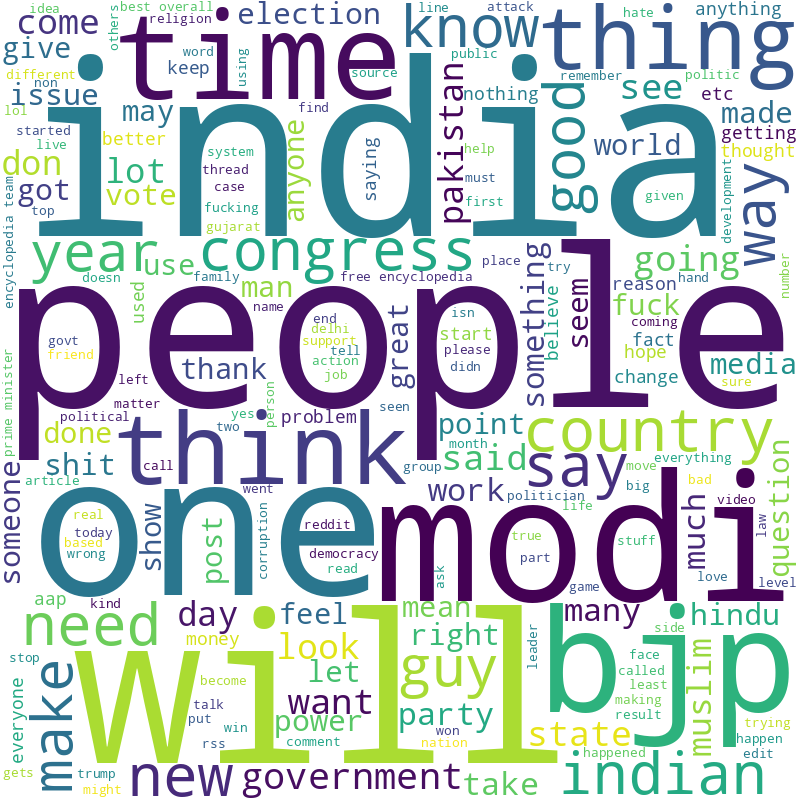
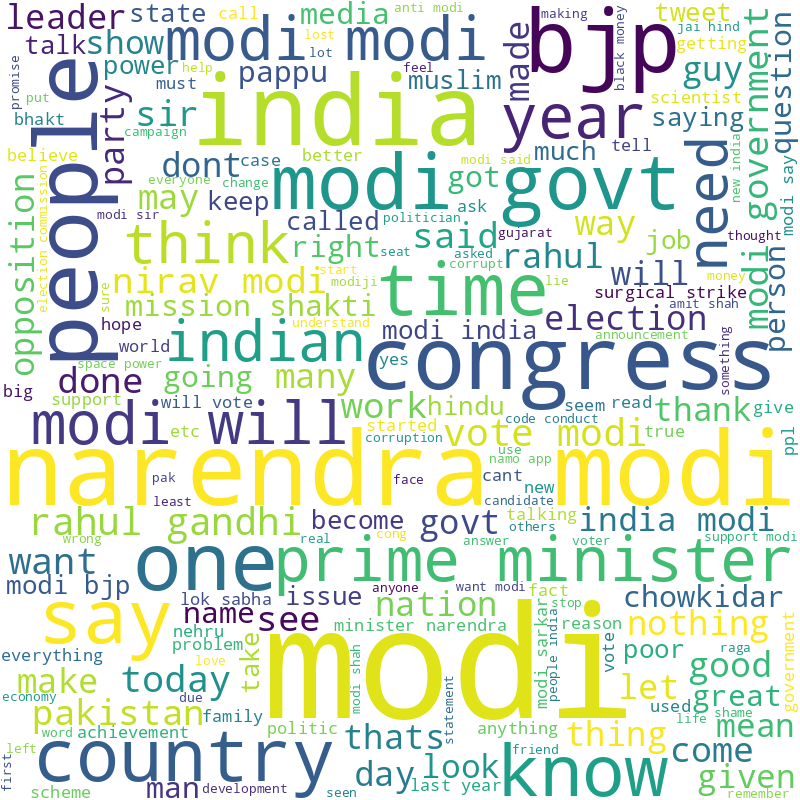
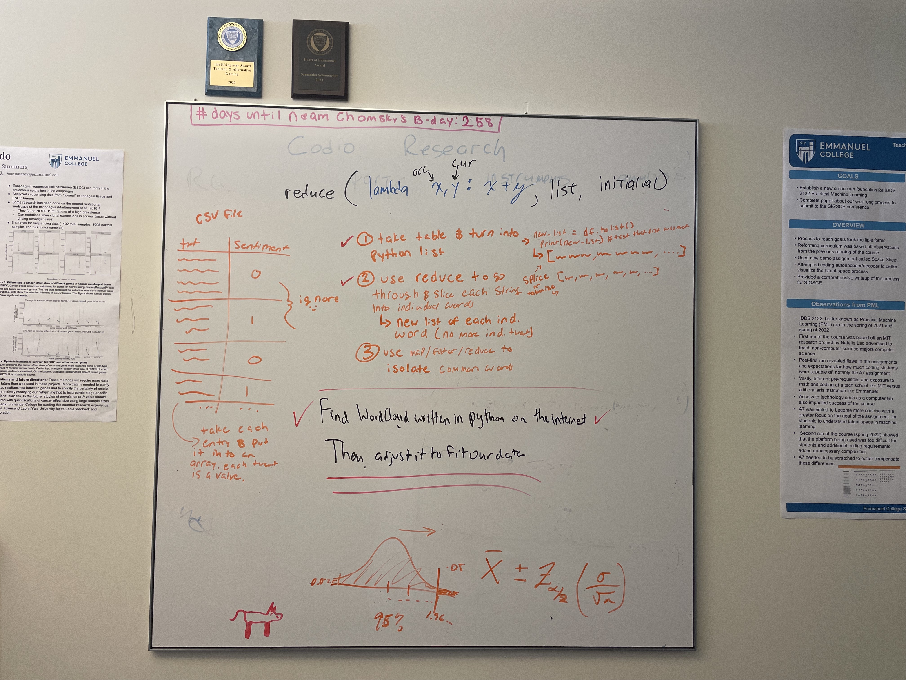

# Programming-II-Final-Project-

We extracted a Kaggle Twietter and Reddit Sentimental analysis Dataset derived from there respectived APIs. The comments and tweets were made on Narendra Modi, Other Leaders, and People's opinion toward the Next Prime Minister of the Nation (General Elections in India -2019). The Twitter data set held ~163K tweets whereas the Reddit.csv had ~37K comments. We then utilized a Natural Language Toolkit (NLTK) platform to filter out common words such as the, we, them. Next with the newly filtered .json datset we worked with the world cloud generator to obtain our cloud. 


## Libraries Utilized
``` 
from wordcloud import WordCloud
import matplotlib.pyplot as plt
import pandas as pd
import json
import csv
from functools import reduce
import operator 
```
## Data Management
```
def read_json_file(filename):
    f = open(filename, 'r')
    data = json.load(f)
    f.close()
    return data
``` 
* json.load -> used to read the JSON document from python 
    - converts the JSON string document into a Python dictionary 
    - helps retrive the data from JSON to python
    
## Word Cloud Code

```
words_list = read_json_file("filtered_tweet_words.json")
text = ' '.join(words_list)

wordcloud = WordCloud(width = 800, height = 800,
				background_color ='white',
				min_font_size = 10).generate(text)
```
* Takes all the elements and joins them into a single string of data in order to plot the data cloud

## Word Cloud Image 
```
plt.figure(figsize = (8, 8), facecolor = None)
plt.imshow(wordcloud)
plt.axis("off")
plt.tight_layout(pad = 0)

plt.show()
``` 

 > Here is our Reddit wordcloud:


 > Here is our Twitter wordcloud:



## Favorite Piece of Code

## Adom 

One part of the code that I particularly enjoyed was when we used the NLTK package to filter a massive list of words and create a JSON file of strings that contained only the words we wanted to include in our final word cloud. Using this package was incredibly helpful, saving us a lot of time and sparing us from the need for extensive logical thinking. Our success with NLTK is a testament to our team's hard work and our growing proficiency with Python, libraries, and documentation. Without NLTK, we would have spent an unnecessary amount of time on a task that ultimately took only minutes to complete.

words_list = read_json_file("filtered_tweet_words.json")
text = ' '.join(words_list)

wordcloud = WordCloud(width = 800, height = 800,
				background_color ='white',
				min_font_size = 10).generate(text)
				
So simple, yet so complex...

## Sammi 




My favorite piece of code is not an actual line a code, rather it is an essential part of the coding process. Shown above are two images of Mark's white board that I used to write out what we were actually trying to accomplish through this project. I often find myself getting overwhelmed while programming and when this happens I try to solve 30 million different problems at once (turns out this is an innefective way to solve problems). Taking a moment to write out the steps of this project allowed me to have a clear objective. With this objective in mind, I knew what idea i needed to turn into code before I got behind the keyboard. *also Mark has been telling me to do this for years and this is the first time I remembered to do it on my own and it was incredibly helpful so thank you mark*

## Maya 

My favorite piece of code was the mechanics of the word cloud generator itself. We imported matplotlib.pyplot as plt which is an interface to the matplot library. The .pyplot opens the figure word cloud on the screen and acts as the figure GUI manager with the interactive plot. The library is interesting as it's a multi-platform data visualization library built on arrays to be used for interactive plots and programmatic plot generation. The library made it very easy to visualize and manipulate any details of the plot. 

## Citations

[Twitter and Reddit Sentimental analysis Dataset](https://www.kaggle.com/datasets/cosmos98/twitter-and-reddit-sentimental-analysis-dataset)
- Credit: [Chaithanya Kumar A](https://www.kaggle.com/cosmos98)
- License: [CC BY-NC-SA 4.0](https://creativecommons.org/licenses/by-nc-sa/4.0/)

[NLTK: Natural Language Tool Kit](https://github.com/nltk/nltk)
- Credit: [Tom Aarsen, and a lof of other people we are very thankful for!](https://www.nltk.org/team.html)
- License: [Apache License 2.0](https://github.com/nltk/nltk/blob/develop/LICENSE.txt)

[Generating WordClouds in Python Tutorial ](https://www.datacamp.com/tutorial/wordcloud-python)
- Credit: [Duong Vu](https://www.datacamp.com/profile/dqvu)
- License: [None Listed](https://www.datacamp.com/terms-of-use#preamble)
    

